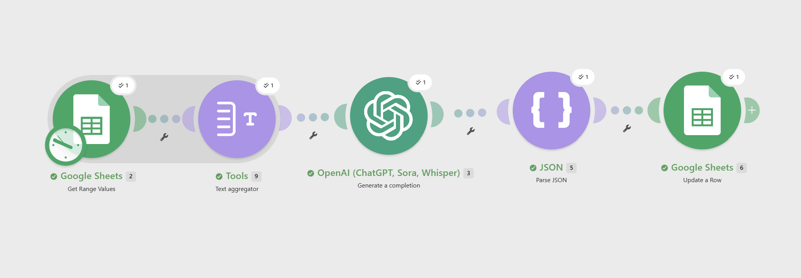

# AI Reporting / Business Intelligence Automation

An AI-powered business intelligence and reporting automation built with Make.com, OpenAI, and Google Sheets.

This automation converts structured business operations data into a concise management report containing key performance insights, department and request-type analysis, and recommended business actions.

## Business Problem

Businesses often collect operational data in spreadsheets but manually analyze it to understand:

* Request volume
* Completion performance
* Priority workload
* Resolution time
* Customer satisfaction
* Department performance
* Request-type trends
* Operational bottlenecks

Manual reporting is time-consuming and can delay decision-making.

This project automates that reporting process using AI.

## Solution

The automation retrieves business data from Google Sheets, aggregates the complete dataset, sends it to OpenAI for analysis, parses the structured AI response, and writes the resulting management insights back into the reporting sheet.

## Workflow Architecture

Google Sheets → Text Aggregator → OpenAI → JSON Parse → Google Sheets

## How It Works

### 1. Business Data Collection

Business operations data is stored in a Google Sheets worksheet containing:

* Date
* Department
* Request Type
* Requests Received
* Requests Completed
* High Priority
* Medium Priority
* Low Priority
* Average Resolution Time
* Customer Satisfaction Score

### 2. Data Aggregation

The Text Aggregator combines all business-data rows into a structured text dataset before sending it to the AI model.

This ensures that the AI analyzes the complete dataset rather than a single spreadsheet row.

### 3. AI Business Intelligence Analysis

OpenAI analyzes the complete dataset and generates:

* Total request volume
* Overall completion performance
* High-priority workload
* Average resolution time
* Average customer satisfaction
* Department-level patterns
* Request-type patterns
* Potential bottlenecks
* Recommended business actions

### 4. Structured AI Output

The AI response is returned as JSON containing:

```json
{
  "key_insights": "",
  "recommended_actions": ""
}
```

### 5. JSON Parsing

The JSON Parse module extracts the AI-generated fields into structured values.

### 6. Automated Reporting

Google Sheets automatically updates the AI Report with:

* KPI calculations
* AI-generated Key Insights
* AI-generated Recommended Actions

## Sample Results

The automation successfully analyzed the business dataset and generated:

* Total Requests: 464
* Completion Rate: 86.4%
* High Priority Requests: 69
* Average Resolution Time: 13.7 hours
* Average Customer Satisfaction: 4.22/5

The AI also identified department and request-type performance patterns and generated practical operational recommendations.

## Tools & Technologies

* Make.com
* OpenAI
* Google Sheets
* JSON
* AI Automation
* Business Intelligence Concepts

## Key Skills Demonstrated

* Business process analysis
* No-code automation
* AI workflow design
* Data aggregation
* Structured AI output
* JSON parsing
* Spreadsheet automation
* KPI analysis
* Business intelligence reporting
* Operational insight generation
* AI-driven decision support

## Screenshots

### Workflow



### OpenAI Configuration


### OpenAI Prompt


### Final AI Business Intelligence Report


## Business Value

This automation reduces manual reporting effort by transforming raw operational data into an AI-generated management report.

It can help teams:

* Monitor operational performance
* Identify workload pressure
* Detect slower-performing areas
* Understand customer satisfaction patterns
* Prioritize improvement opportunities
* Make faster data-informed decisions

## Future Improvements

Potential extensions include:

* Automated scheduled reporting
* Email delivery of management reports
* Dashboard visualization
* Historical performance comparison
* Automated anomaly detection
* Department-specific reporting
* Trend analysis across longer time periods

## Project Status

Completed and tested successfully.

## Author

Muskan Arora
